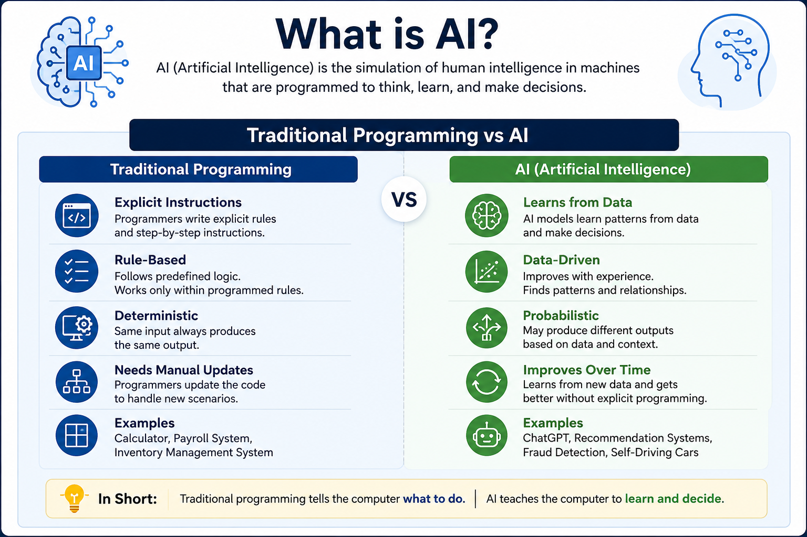
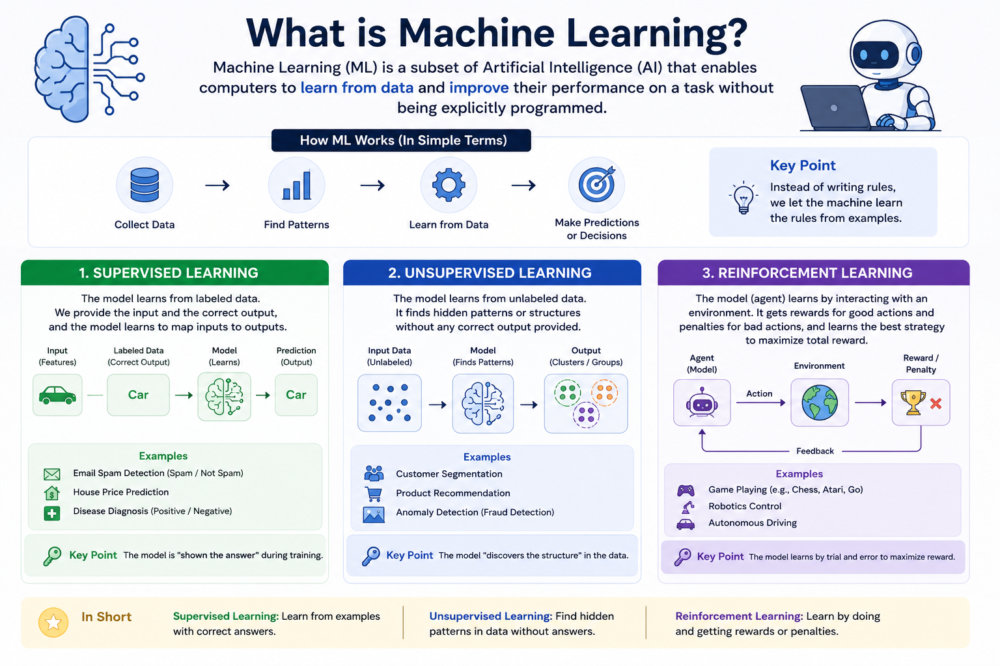
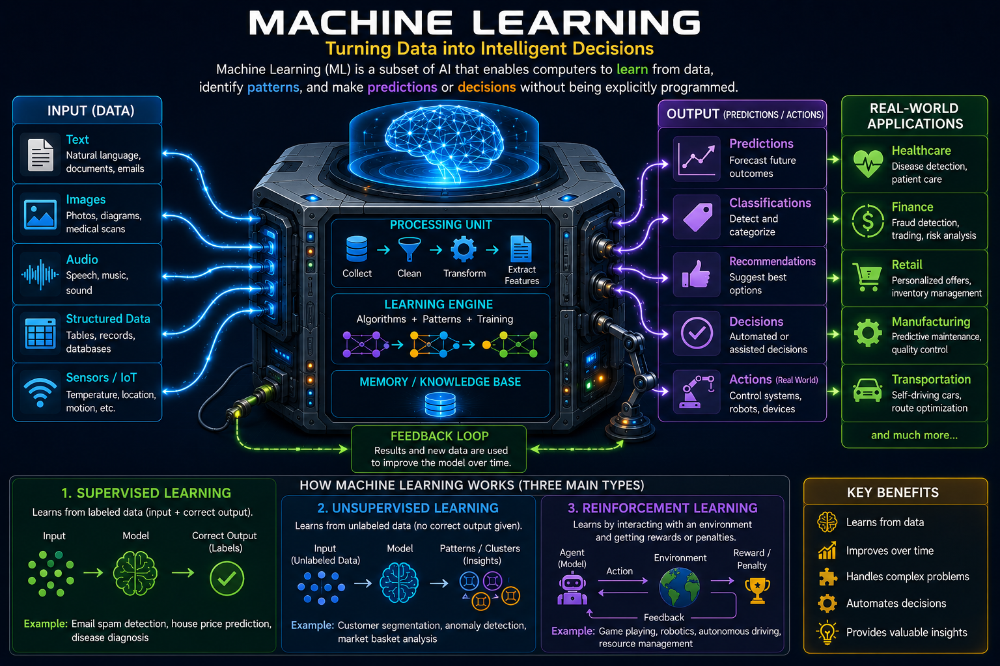

# AI Security Learning Notes

This repository follows a recommended learning flow for AI, LLMs, prompt engineering, responsible AI, and AI security concepts.

---

## Recommended Flow

1. [What is AI? - Traditional Programming vs AI](#1-what-is-ai)
2. [What is Machine Learning? - Supervised, Unsupervised, Reinforcement Learning](#2-what-is-machine-learning)
3. [How LLM Works - Tokens -> Embeddings -> Attention -> Prediction](#3-how-llm-works)
4. [Why GPUs Are Important for AI - Parallel processing and model training](#4-why-gpus-are-important-for-ai)
5. [Prompt Engineering - System Prompt, User Prompt, Context Window](#5-prompt-engineering)
6. [Jailbreak Attacks - Bypassing AI guardrails](#6-jailbreak-attacks)
7. [Hallucinations - Why AI generates incorrect information](#7-hallucinations)
8. [13 Responsible AI Principles - Safety, Fairness, Transparency, Accountability, Privacy, and related principles](#8-13-responsible-ai-principles)
9. [RAG (Retrieval-Augmented Generation) - Grounding responses with enterprise data](#9-rag-retrieval-augmented-generation)
10. [MCP (Model Context Protocol) - Connecting AI to tools, APIs, and data sources](#10-mcp-model-context-protocol)

---

## 1. What is AI?

Artificial Intelligence is the ability of a computer system to learn from data, recognize patterns, make decisions, generate content, and solve problems in ways that normally require human intelligence.

<p align="center">
  
</p>


---

## 2. What is Machine Learning?

**Machine Learning (ML)** is a branch of Artificial Intelligence (AI) that enables computers to **learn from data**, identify patterns, and make predictions or decisions **without being explicitly programmed for every task**.

### Simple Definition

Instead of telling a computer **exactly what to do**, we provide it with **data**, and it learns the rules by itself.

### How Machine Learning Works

```text
Data -> Learning Algorithm -> Model -> Prediction / Decision
```

<p align="center">
  
</p>

<p align="center">
  
</p>


---

## 3. How LLM Works

Large Language Models process and generate text by converting input into tokens, transforming those tokens into embeddings, using attention to understand context, and predicting the next likely token.

<p align="center">
  
</p>

### Tokens -> Embeddings -> Attention -> Prediction

```text
Input text -> Tokens -> Embeddings -> Attention -> Next-token prediction -> Response
```

| Step | What happens |
|---|---|
| Tokens | Text is split into smaller pieces the model can process. |
| Embeddings | Tokens are converted into numerical vectors that capture meaning. |
| Attention | The model decides which parts of the input are most relevant. |
| Prediction | The model predicts the next token and repeats until the response is complete. |

---

## 4. Why GPUs Are Important for AI

GPUs are important for AI because they perform many mathematical operations in parallel. AI models rely on large-scale matrix and vector calculations, especially during model training and inference.

### Parallel Processing and Model Training

| GPU Strength | Why it matters |
|---|---|
| Parallel processing | Runs many calculations at the same time. |
| Faster training | Helps train large models on huge datasets. |
| Faster inference | Produces AI responses more quickly. |
| Scalability | Multiple GPUs can be combined for larger workloads. |

Without GPUs, training modern AI models would be much slower and more expensive.

---

## 5. Prompt Engineering

Prompt Engineering is the practice of writing clear, structured instructions so an AI system produces useful, accurate, and safe responses.

### System Prompt, User Prompt, Context Window

| Prompt Concept | Meaning |
|---|---|
| System Prompt | High-priority instruction that defines the model's role, behavior, and boundaries. |
| User Prompt | The user's request or question. |
| Context Window | The amount of text, instructions, and retrieved information the model can consider at once. |

Good prompts provide clear intent, useful context, constraints, and expected output format.

---

## 6. Jailbreak Attacks

Jailbreak attacks are attempts to bypass AI safety controls or guardrails. Attackers may try to make the model ignore instructions, reveal restricted information, or produce unsafe content.

### Bypassing AI Guardrails

Common jailbreak techniques include:

| Technique | Description |
|---|---|
| Instruction override | Asking the model to ignore previous rules. |
| Role-play | Framing unsafe requests as fictional scenarios. |
| Obfuscation | Hiding intent through encoding, translation, or indirect wording. |
| Multi-step prompting | Gradually steering the model toward restricted behavior. |

Strong system prompts, input validation, output checks, monitoring, and least-privilege tool access help reduce jailbreak risk.

---

## 7. Hallucinations

Hallucinations happen when an AI system generates information that sounds confident but is incorrect, unsupported, or fabricated.

### Why AI Generates Incorrect Information

AI models generate likely text based on learned patterns. They do not automatically know whether every generated statement is true unless they are grounded with reliable context or verified sources.

| Cause | Example |
|---|---|
| Missing context | The model guesses when it lacks enough information. |
| Outdated knowledge | The model may not know recent facts. |
| Ambiguous prompt | The model fills gaps with assumptions. |
| No source grounding | The model answers without trusted references. |

RAG, citations, validation, and human review can reduce hallucinations in important workflows.

---

## 8. 13 Responsible AI Principles

Responsible AI focuses on building AI systems that are safe, fair, transparent, accountable, and aligned with human values.

### Key Responsible AI Principles

| # | Principle | Meaning |
|---|---|---|
| 1 | Safety | Avoid harmful or unsafe outcomes. |
| 2 | Fairness | Reduce bias and unequal treatment. |
| 3 | Transparency | Make AI behavior and limitations understandable. |
| 4 | Accountability | Keep humans and organizations responsible for outcomes. |
| 5 | Privacy | Protect personal and sensitive data. |
| 6 | Security | Defend AI systems from misuse and attack. |
| 7 | Reliability | Ensure consistent and dependable behavior. |
| 8 | Robustness | Perform well under unexpected or adversarial inputs. |
| 9 | Explainability | Help users understand why outputs were produced. |
| 10 | Human Oversight | Keep humans involved in high-impact decisions. |
| 11 | Inclusiveness | Design for diverse users and needs. |
| 12 | Governance | Use policies, controls, and review processes. |
| 13 | Sustainability | Consider environmental and operational impact. |

These principles help teams build AI that can be trusted in real-world environments.

---

## 9. RAG (Retrieval-Augmented Generation)

RAG improves AI responses by retrieving trusted external knowledge before generating an answer. This helps the model ground responses in enterprise data, documents, policies, or knowledge bases.

### Grounding Responses with Enterprise Data

```text
User question -> Retrieve relevant enterprise data -> Add context to prompt -> Generate grounded answer
```

| Benefit | Why it helps |
|---|---|
| More accurate answers | Responses are based on trusted source material. |
| Reduced hallucinations | The model has retrieved evidence to use. |
| Enterprise knowledge | Internal documents can guide responses. |
| Traceability | Sources can be shown or audited. |

RAG systems should validate retrieved content, protect sensitive data, and defend against prompt injection hidden inside documents.

---

## 10. MCP (Model Context Protocol)

MCP standardizes how AI applications connect models to tools, APIs, and data sources. It gives AI systems a structured way to access external capabilities and context.

### Connecting AI to Tools, APIs, and Data Sources

| MCP Area | Purpose |
|---|---|
| Tools | Let AI systems perform controlled actions. |
| APIs | Connect models to external services. |
| Data sources | Provide access to files, databases, and knowledge systems. |
| Security controls | Define what the model can access and under what conditions. |

MCP is useful because modern AI systems often need more than a model. They need safe, governed access to tools and information.
